# Mermaid로 다이어그램 사용하기

## 시퀀스 다이어그램: 블로깅 앱 서비스 통신

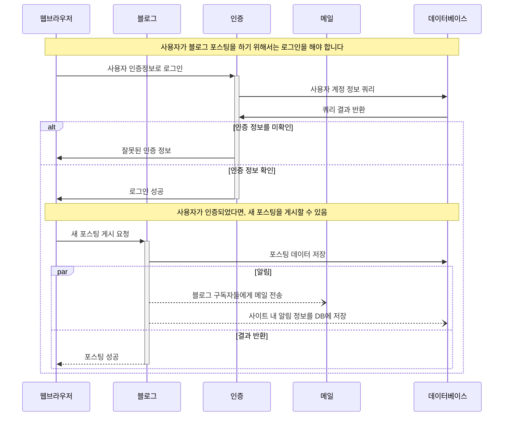

## Mermaid.js 소개
- Markdown에서 영감을 받은 개발됨.
- 텍스트 정의를 렌더링하여 다이어그램을 동적으로 생성하고 수정하는 JavaScript 기반 다이어그램 작성 및 차트 작성 도구
- 개발자의 아이들이 TV로 인어공주를 보는 동안 사이드 프로젝트를 시작해 이름을 `Mermaid`로 작명
- 마크업 텍스트만으로 각종 다이어그램을 표현하는 것이 가능
- 무겁고 부피가 큰 다른 도구를 사용하지 않아도 됨
- 핵심 목표 중 하나는 문서 작성을 돕고 개발을 따라잡는 것
- 오픈소스

## Markdown
- 마크다운은 일반 텍스트 편집기를 사용하여 서식 있는 텍스트를 만들 수 있는 경량 마크업 언어.
- 마크다운 형식을 사용하면 작성자가 서식을 적용하여 텍스트를 작성할 수 있지만 텍스트를 읽기 어렵게 만드는 태그는 없음.
- 쓰기 쉽고 읽기 쉬운 장점
- HTML, PDF와 같은 다른 형식으로 쉽게 변환 가능

[Makrdown 사용법](./Markdown.md)

## Markdown과 Mermaid를 함께 사용해야 하는 이유
- 주의가 산만해지는 요소 최소화: 워드프로세서의 서식 지정 가능성에 주의가 산만해져서 내용 작성에 집중하는 대신 문서가 어떻게 보여지는지에 더 많이 집중하게 됨.
- 문서의 버전 관리: 문서에 대한 변경 사항을 텍스트와 동일한 방식으로 처리 가능.
- 더 적은 수의 컨텍스트 전환으로 집중을 유지: 문서 작성을 더 효율적으로 하는 방법은 작성 중에 컨텍스트 전환을 최소화하는 것. 다른 다이어그램 작성 도구로 전환하지 않고 편집기, 코드작성 IDE 내에서 모든 작업 가능.
- 버전 관리를 하게 되면 누가 언제 어떤 내용을 변경했는지 쉽게 확인 가능.
- 다이어그램을 사용하면 문서를 더 쉽게 이해할 수 있고 더 많은 정보를 얻을 수 있음

## Markdown 내에 Mermaid 다이어그램 추가하기

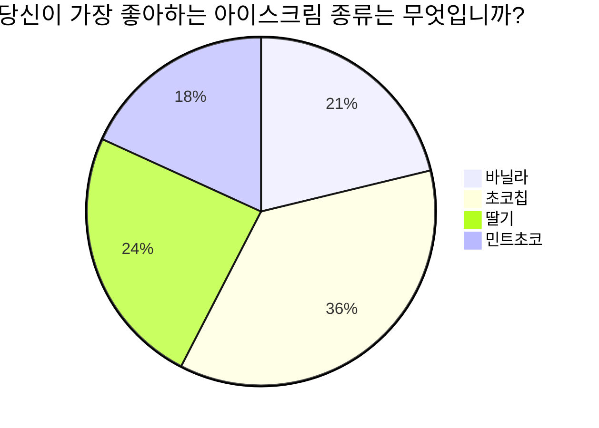
최고의 아이스크림은 초코칩!

```
pie title 당신이 가장 좋아하는 아이스크림 종류는 무엇입니까?
	"바닐라": 70
	"초코칩": 120
	"딸기": 80
	"민트초코": 60
```

## 사용 가능 서비스
- Github
- GitLab
- Gitea
- GitBook (플러그인 설치하여 사용)
- LiveBook
- Joplin
- Notion
- Obsidian
- Jetbain IDE
- VS Code
- Atom
- Sublime Text 3
- Confluent (플러그인 설치하여 사용)
- Jira (플러그인 설치하여 사용)
- WordPress
- Hexo
- Nextra
- Google Docs (플러그인 설치하여 사용)
- Sphinx
- remark
- Gatsby
- Jekyll
- JSDoc
- Typora
- ...

## Live 에디터로 손쉽게 작성하기
[Mermaid Live Editor](https://mermaid.live/)
- Mermaid 다이어그램을 실시간으로 렌더링하기 위한 무료 온라인 편집기
- 텍스트 편집기도 훌륭한 도구이지만 Mermaid에 좀 더 쉽게 접근하기 위해 Live Editor는 아주 좋은 선택

## 많이 사용되는 다이어그램

### 순서도(Flowchart)

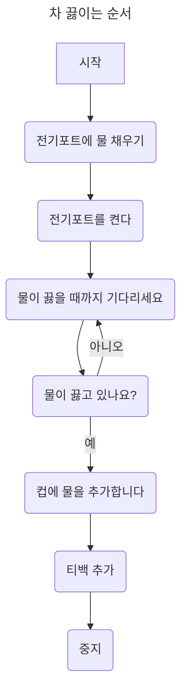

```
---
title: 차 끓이는 순서
---
flowchart TB
	A[시작] --> B(전기포트에 물 채우기)
	B --> C(전기포트를 켠다) --> H
	H --> D(물이 끓고 있나요?)
	D -- 예 --> E(컵에 물을 추가합니다)
	D -- 아니오 --> H(물이 끓을 때까지 기다리세요)
	E --> F(티백 추가)
	F --> G(중지)
```

[순서도 다이어그램 구문](https://mermaid.js.org/syntax/flowchart.html)

### 시퀀스 다이어그램
프로세스가 서로 어떻게 작동하고 어떤 순서로 작동하는지 보여주는 상호 작용 다이어그램
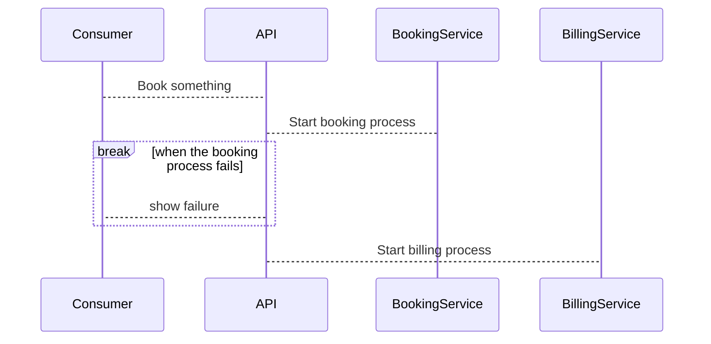

```
sequenceDiagram
    Consumer-->API: Book something
    API-->BookingService: Start booking process
    break when the booking process fails
        API-->Consumer: show failure
    end
    API-->BillingService: Start billing process
```

### 클래스 다이어그램
소프트웨어 엔지니어링에서 시스템의 클래스, 해당 속성, 작업(또는 메서드) 및 객체 간 관계를 보여줌으로써 시스템의 구조를 설명하는 일종의 정적 구조 다이어그램

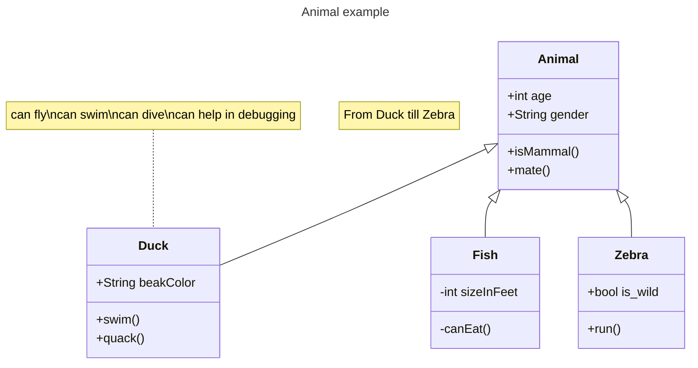

```
---
title: Animal example
---
classDiagram
    note "From Duck till Zebra"
    Animal <|-- Duck
    note for Duck "can fly\ncan swim\ncan dive\ncan help in debugging"
    Animal <|-- Fish
    Animal <|-- Zebra
    Animal : +int age
    Animal : +String gender
    Animal: +isMammal()
    Animal: +mate()
    class Duck{
        +String beakColor
        +swim()
        +quack()
    }
    class Fish{
        -int sizeInFeet
        -canEat()
    }
    class Zebra{
        +bool is_wild
        +run()
    }
```

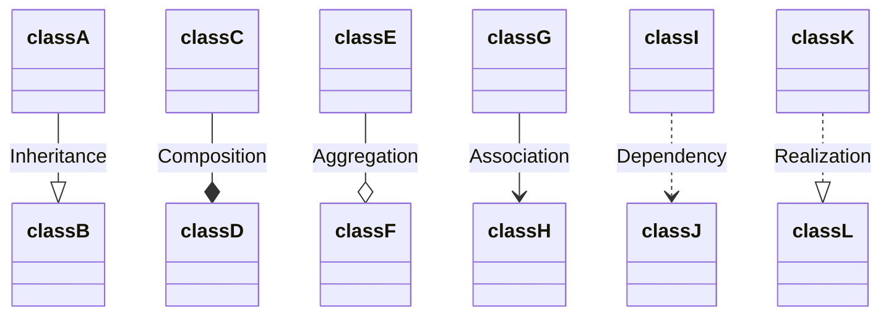

[클래스 다이어그램 구문](https://mermaid.js.org/syntax/classDiagram.html)

### 상태 다이어그램
컴퓨터 과학 및 관련 분야에서 시스템의 동작을 설명하는 데 사용되는 다이어그램 유형입니다.

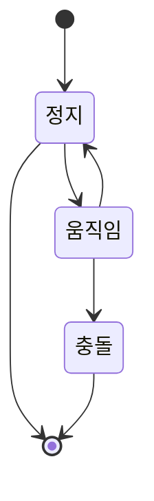

```
stateDiagram
    [*] --> 정지
    정지 --> [*]

    정지 --> 움직임
    움직임 --> 정지
    움직임 --> 충돌
    충돌 --> [*]
```

복합적인 상태 표현
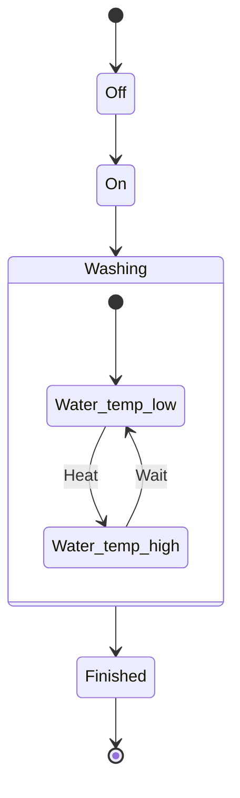

```
stateDiagram
	[*] --> Off
	Off --> On
	On --> Washing
	state Washing {
	[*] --> Water_temp_low
	Water_temp_low --> Water_temp_high : Heat
	Water_temp_high --> Water_temp_low : Wait
	}
	Washing --> Finished
	Finished --> [*]
```

[상태 다이어그램 구문](https://mermaid.js.org/syntax/stateDiagram.html)

### 엔터티 관계 다이어그램
개체-관계 모델(ER 모델)은 특정 지식 영역에서 상호 관련된 관심 사항을 설명합니다. 기본 ER 모델은 관심 항목을 분류하는 엔터티 유형으로 구성되며 엔터티 간에 존재할 수 있는 관계를 지정합니다.

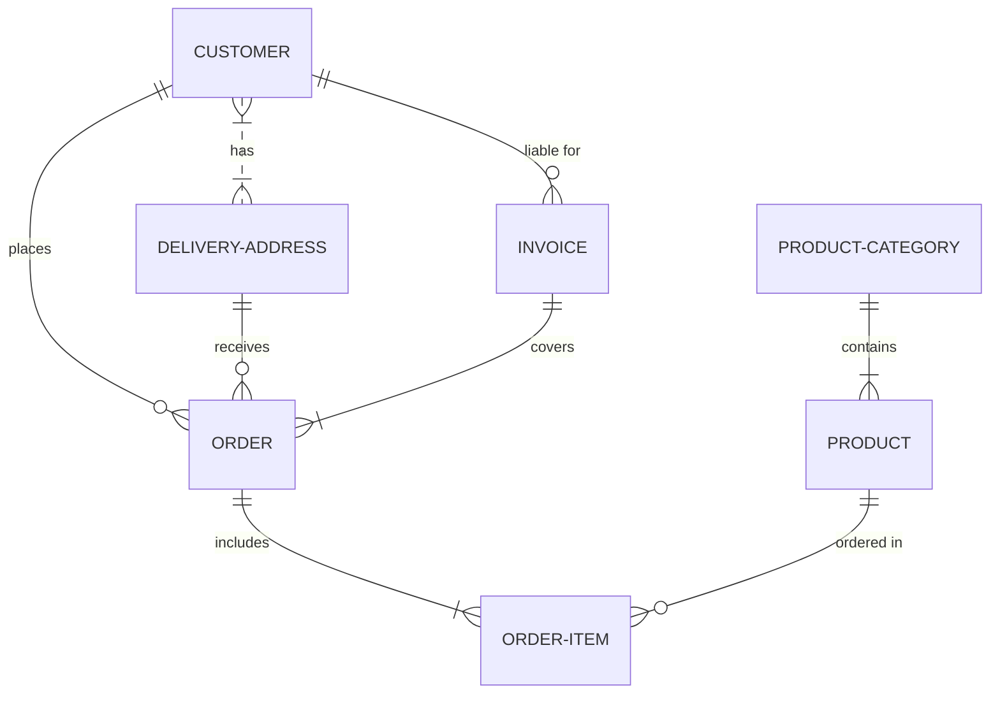

```
erDiagram
	CUSTOMER }|..|{ DELIVERY-ADDRESS : has
	CUSTOMER ||--o{ ORDER : places
	CUSTOMER ||--o{ INVOICE : "liable for"
	DELIVERY-ADDRESS ||--o{ ORDER : receives
	INVOICE ||--|{ ORDER : covers
	ORDER ||--|{ ORDER-ITEM : includes
	PRODUCT-CATEGORY ||--|{ PRODUCT : contains
	PRODUCT ||--o{ ORDER-ITEM : "ordered in"
```

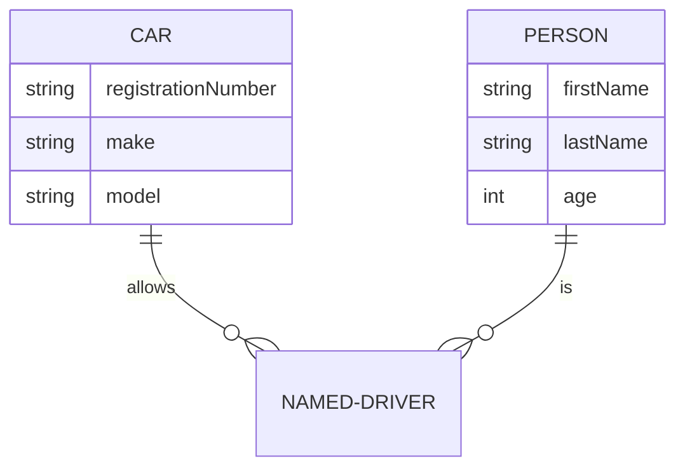

```
erDiagram
    CAR ||--o{ NAMED-DRIVER : allows
    CAR {
        string registrationNumber
        string make
        string model
    }
    PERSON ||--o{ NAMED-DRIVER : is
    PERSON {
        string firstName
        string lastName
        int age
    }
```

[엔터티 다이어그램 구문](https://mermaid.js.org/syntax/entityRelationshipDiagram.html)

### 사용자 여정 다이어그램
사용자 여정은 다양한 사용자가 시스템, 애플리케이션 또는 웹 사이트 내에서 특정 작업을 완료하기 위해 수행하는 단계를 매우 자세하게 설명합니다. 이 기술은 현재(있는 그대로) 사용자 워크플로를 보여주고 향후 워크플로에 대한 개선 영역을 드러냅니다.

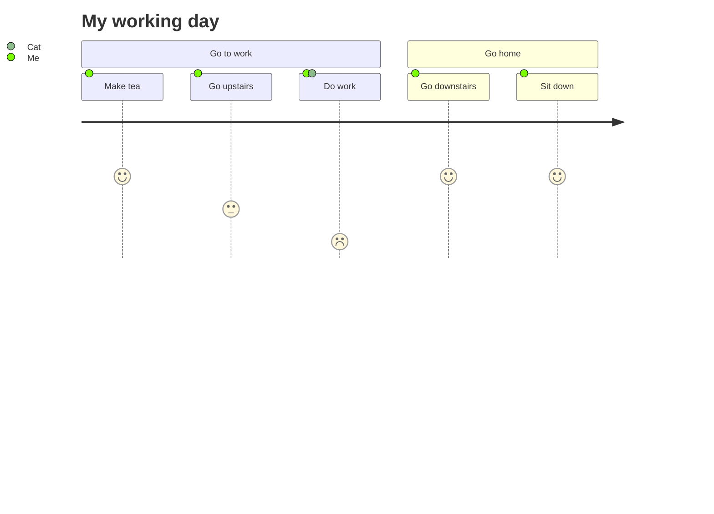

```
journey
    title My working day
    section Go to work
      Make tea: 5: Me
      Go upstairs: 3: Me
      Do work: 1: Me, Cat
    section Go home
      Go downstairs: 5: Me
      Sit down: 5: Me
```

[상태 다이어그램 구문](https://mermaid.js.org/syntax/userJourney.html)

### 간트 차트(Gantt Chart)
간트 차트는프로젝트 일정과 하나의 프로젝트를 선택하는 데 필요한 시간을 표시합니다. 간트 차트는 프로젝트의 최종 요소와 요약 요소의 시작 날짜와 종료 날짜 사이의 일수를 표시합니다.

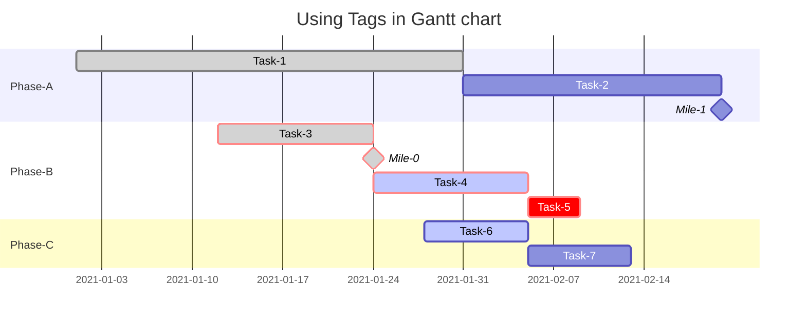

```
gantt
	title Using Tags in Gantt chart
	section Phase-A
		Task-1 : done,a1, 2021-01-01, 30d
		Task-2 : after a1  , 20d
		Mile-1 : milestone, 0d
	section Phase-B
		Task-3 : done,crit, 2021-01-12 , 12d
		Mile-0 : done, milestone,crit,0d
		Task-4 : active,crit,12d
		Task-5 : crit, 4d
	section Phase-C
		Task-6 : active, 2021-01-28,8d
		Task-7 : 8d
```

[간트 차트 구문](https://mermaid.js.org/syntax/gantt.html)

### 파이 차트(Pie Chart)
숫자 비율을 보여주기 위해 여러 조각으로 나누어진 원형 통계 그래픽입니다.

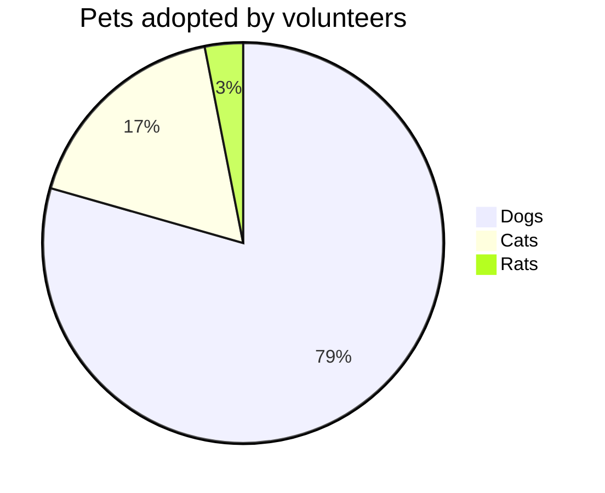

```
pie title Pets adopted by volunteers
    "Dogs" : 386
    "Cats" : 85
    "Rats" : 15
```

[파이 차트 구문](https://mermaid.js.org/syntax/pie.html)

### 사분면 차트(Quadrant Chart)
숫자 비율을 보여주기 위해 여러 조각으로 나누어진 원형 통계 그래픽입니다.

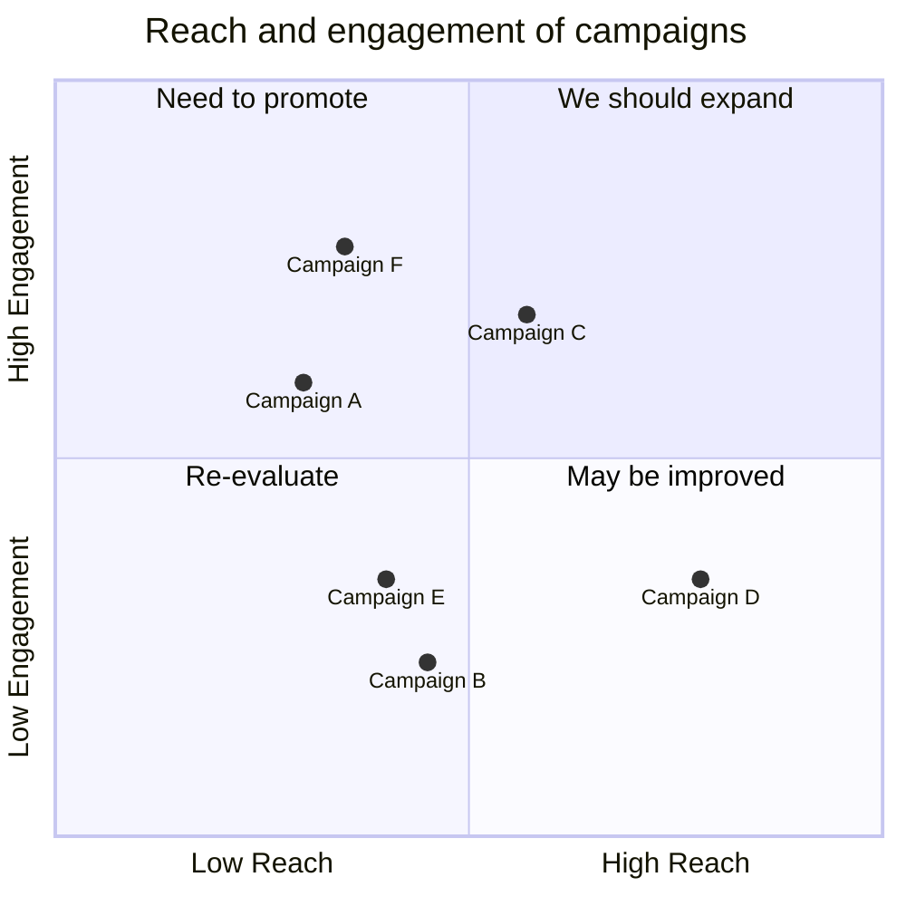

```
quadrantChart
    title Reach and engagement of campaigns
    x-axis Low Reach --> High Reach
    y-axis Low Engagement --> High Engagement
    quadrant-1 We should expand
    quadrant-2 Need to promote
    quadrant-3 Re-evaluate
    quadrant-4 May be improved
    Campaign A: [0.3, 0.6]
    Campaign B: [0.45, 0.23]
    Campaign C: [0.57, 0.69]
    Campaign D: [0.78, 0.34]
    Campaign E: [0.40, 0.34]
    Campaign F: [0.35, 0.78]
```

[사분면 차트 구문](https://mermaid.js.org/syntax/quadrantChart.html)

### 마인드맵(Mind Map)
숫자 비율을 보여주기 위해 여러 조각으로 나누어진 원형 통계 그래픽입니다.

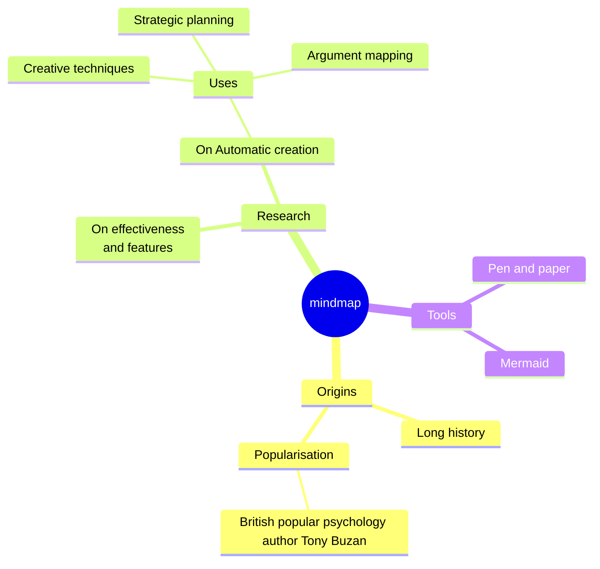

```
mindmap
  root((mindmap))
    Origins
      Long history
      ::icon(fa fa-book)
      Popularisation
        British popular psychology author Tony Buzan
    Research
      On effectiveness<br/>and features
      On Automatic creation
        Uses
            Creative techniques
            Strategic planning
            Argument mapping
    Tools
      Pen and paper
      Mermaid
```

[마인드맵 구문](https://mermaid.js.org/syntax/mindmap.html)

## Mermaid 구성 수정 방법

### 지시문(Directive)
다이어그램 코드 내에서 작동하는 방식을 제어하는 방법

```
%%{init: {"sequence": {"mirrorActors":false}}}%%
sequenceDiagram
	요리->>+타이머: 3분 후 알림
	타이머-->>-요리: 완료!
	Note left of 타이머: mirrorActors(아래부분 시퀀스) 표시안함
```

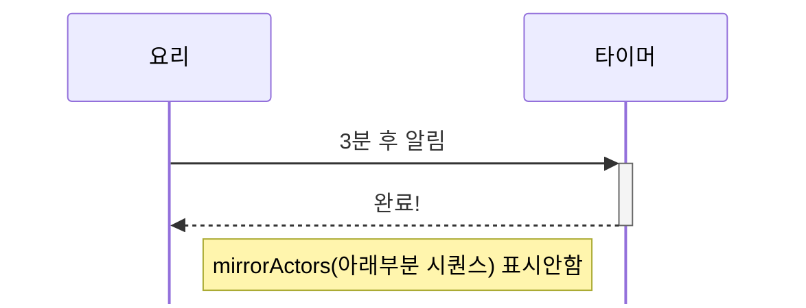

지시문이 없는 경우
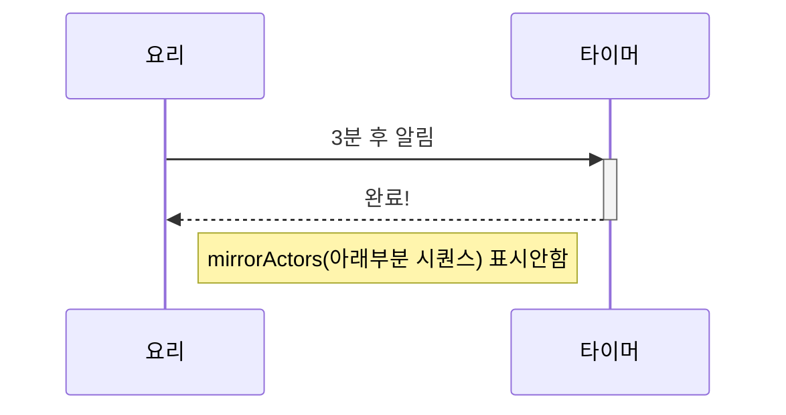

[지시문 사용 방법](https://mermaid.js.org/config/directives.html)


## 활용 사례 1: HTML에 다이어그램 표현
https://codepen.io/123unme/pen/BQwZzq
Text Input: https://codepen.io/Ryuno-Ki/pen/LNxwgR

## 활용 사례 2: 다이어그램 가이드 작성
https://kubernetes.io/docs/contribute/style/diagram-guide/
https://www.kubernetes.dev/blog/2021/12/01/improve-your-documentation-with-mermaid.js-diagrams/

## 활용 사례 3: 프로젝트 문서 설명
https://github.com/monolith-rnd/sgp-guild-api
https://github.com/monolith-rnd/mommos-cli


